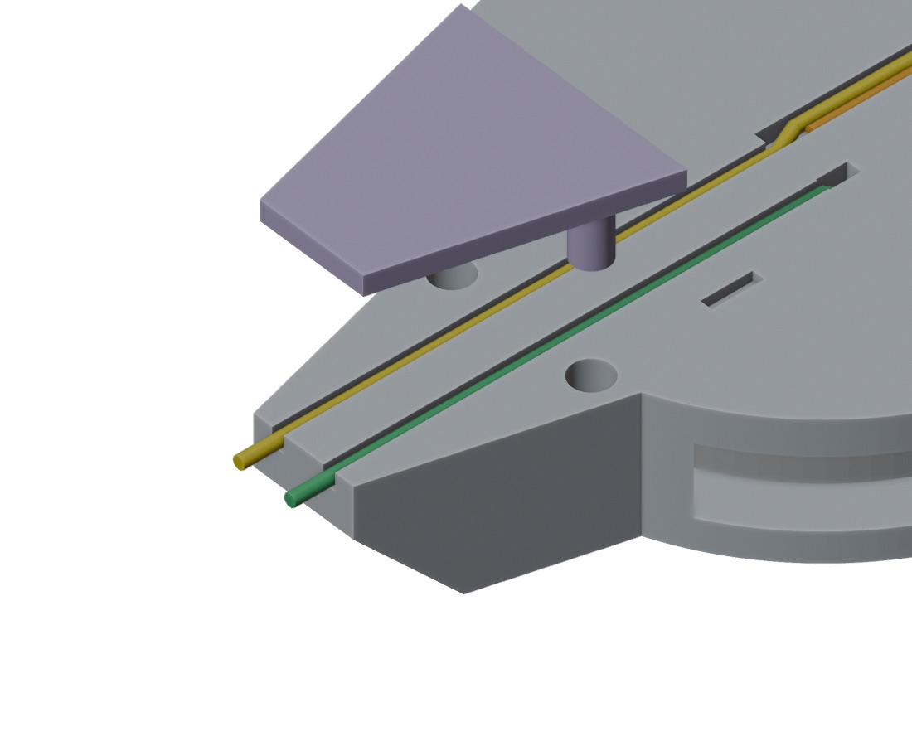
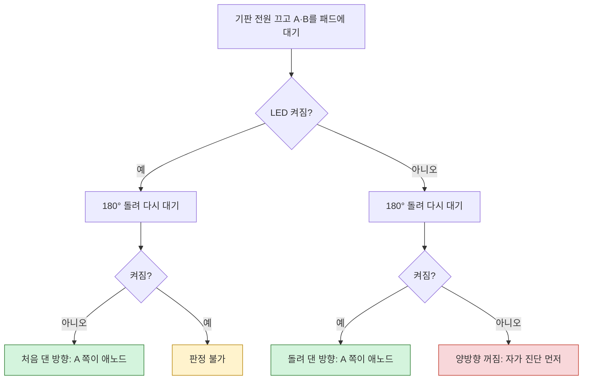

# cr2025-led-tester
CR2025 LED Tester - 3D Printer

CR2025 코인셀 하나와 파란 5mm LED로, 검사 기판에 납땜된 **1N4148WS(SOD-323) 다이오드의 방향**을 확인하는 3D 프린팅 테스터입니다. 노즈 끝의 두 철사를 다이오드 양쪽 패드에 대면, 방향이 맞을 때 위쪽 LED가 켜집니다. 납땜 없이 LED·저항에서 잘라낸 다리를 케이스 홈에 눌러 끼워 만듭니다.

## 파일

| 파일 | 내용 |
|---|---|
| `stl/tester.stl` | 본체. 배터리 슬롯, LED 받침, 철사 홈, 노즈 |
| `stl/cover.stl` | 케이블 커버. 노즈 구간의 철사를 덮어 누르는 별도 부품 |
| `stl/nose-coupon.stl` | 노즈 시험편. 프로브 간격과 홈 폭을 맞출 때만 씁니다 |
| [docs/assembly.md](docs/assembly.md) | 조립·사용 안내 전체 (인쇄 설정, 조립 순서, 판정 규칙, 문제 해결) |
| [docs/coupon.md](docs/coupon.md) | 노즈 시험편 사용법과 결과 기록 (간격 2.2mm, 홈 폭 0.5mm로 확정) |
| `cad/` | 모델 원본. FreeCAD `freecadcmd`로 실행하는 Python 스크립트와 치수 검사 |

## 준비물

- **인쇄**: `stl/tester.stl`, `stl/cover.stl`
  - Bambu, PLA, 0.4mm 노즐, 레이어 0.12–0.16mm, 서포트 없음
  - 본체는 평평한 뒷면을 바닥에, 커버는 파일 그대로(판이 바닥, 핀이 위) 놓습니다.
- **부품**: CR2025 1개, 파란 5mm LED 1개, 잘라낸 다리 2가닥
  - 연장 다리 A는 약 32mm, 철사 B는 약 30mm가 필요합니다. 짧으면 Ø0.5 구리 단선도 괜찮습니다.
- **도구**: 니퍼, 롱노즈 플라이어, 핀셋

## 철사 연결 방법

철사 4가닥을 케이스 홈에 눌러 끼우고, 노즈 구간은 케이블 커버로 덮은 뒤, **배터리는 맨 마지막에** 넣습니다. 아래 그림은 실제 모델(`stl/tester.stl`, `stl/cover.stl`)에 철사를 색깔별로 그려 넣은 것입니다.

| 색 | 철사 | 가는 곳 |
|---|---|---|
| 🔴 빨강 | **② 애노드 다리**: LED 긴 다리 | 뒤쪽 터널 → 배터리 자리 안쪽 뒷벽 홈 → 배터리 **뒷면(+)** |
| 🟠 주황 | **캐소드 다리**: LED 짧은 다리 | 앞면 홈 A → ① 이음부 |
| 🟡 노랑 | **① 연장 다리 A**: 잘라낸 다리 1가닥 | 이음부에서 주황과 나란히 → 홈 A → 노즈 끝 **A** (▶ 쪽) |
| 🟢 초록 | **③ 철사 B**: 잘라낸 다리 1가닥 | 노즈 끝 **B** (\| 쪽) → 홈 B → ③ 통과 구멍 → 천장 접촉 홈에서 배터리 **앞면(−)**에 선으로 닿음 |

### 완성된 모습 (정면, 홈이 있는 면)


- 맨 위가 **LED**입니다. 주황 캐소드 다리가 앞면 **홈 A**로 내려옵니다.
- 홈이 두 배로 넓은 구간이 **① 이음부**입니다. 여기서 노랑 연장 다리가 주황 옆에 나란히 눌려 이어지고, 노즈 끝 **A**까지 내려갑니다.
- 노즈 구간(약 10mm)은 별도 부품인 **케이블 커버**(보라색)가 덮습니다. 노랑과 초록을 열린 홈에 올려놓고 커버를 꽂으면, 끝으로 패드를 눌러도 철사가 빠지지 않습니다. 그래서 정면 그림에서는 노즈 속 철사가 커버에 가려 끝에서만 보입니다.
- 초록 철사 B는 오른쪽 홈 B에 들어갑니다. 홈 B가 끝나는 곳의 작은 구멍이 **③ 통과 구멍**입니다. 철사 B의 끝 5mm는 이 구멍을 비스듬히 지나 앞판 안쪽 천장의 접촉 홈에 눕고, 배터리 (−) 면에 선으로 닿습니다. 반대쪽 끝은 노즈 **B**입니다.
- 빨강 애노드 다리는 앞판에 가려 정면에서는 보이지 않습니다. 아래 2단계의 단면 그림을 보세요.

전류는 다음 순서로 흐릅니다.

```
배터리(+) → 빨강 → LED → 주황 → 노랑 → 끝 A → 측정 대상 다이오드 → 끝 B → 초록 → 배터리(−)
```

### 1. LED 다리 벌리기


옆에서 본 모습입니다(왼쪽 = 케이스 뒤, 오른쪽 = 앞). 플랜지 바로 아래에서 **긴 다리(애노드, 빨강)**를 **뒤로 약 1mm**, **짧은 다리(캐소드, 주황)**를 **앞으로 약 0.5mm** 꺾습니다. 캐소드는 LED 플랜지의 **평평한 쪽**에 있는 다리입니다.

### 2. LED 꽂기와 ② 애노드 다리 (단면)


케이스를 LED 줄에서 세로로 자른 단면입니다. 왼쪽이 뒤, 오른쪽이 앞이고, 가운데 빈 곳이 배터리 자리입니다.

- LED를 받침 위에서 내려 꽂습니다.
- **빨강**은 뒤쪽 터널을 지나 배터리 자리 안쪽 **뒷벽 홈**을 따라 내려갑니다. **주황**은 앞면 홈 A로 들어갑니다.
- 빨강은 홈 끝(배터리 중심에서 약 4mm 아래)에서 자르고, 가운데를 배터리 쪽으로 **약 0.5mm 활처럼** 휘게 합니다. 이 휨이 배터리 (+) 면을 누르는 스프링입니다.

### 3. ① 이음부: 주황 + 노랑


- **주황**은 넓은 구간의 아래쪽 끝보다 **약 1.5mm 위**에서 자릅니다.
- **노랑**(약 32mm 다리)은 넓은 구간 위쪽 끝부터 주황 **왼쪽 옆에 나란히** 눌러 넣습니다.
- 주황이 끝난 아래에서 홈 가운데로 살짝 옮긴 뒤, 홈 A를 따라 노즈 끝까지 **위에서 눌러** 넣습니다.
- 노즈 끝으로 나온 부분은 **1.5mm** 남기고 **사선으로** 자릅니다.

두 다리가 약 6mm 맞붙어 전기가 통합니다.

### 4. ③ 철사 B: 통과 구멍을 지나 천장 홈에 눕히기 (단면)


철사 B 줄에서 자른 단면입니다. 왼쪽이 앞, 오른쪽이 뒤이고, 가운데 진한 회색이 배터리입니다.

- 잘라낸 다리(약 30mm)의 한쪽 끝에서 **약 5mm**, **약 6mm** 되는 두 곳을 반대 방향으로 조금씩 꺾어 **계단(크랭크) 모양**을 만듭니다. 끝 5mm가 나머지보다 약 0.9mm 낮아집니다.
- 끝 5mm를 ③ 통과 구멍으로 **위쪽을 향해 비스듬히** 밀어 넣습니다. 그다음 슬롯 쪽에서 핀셋으로 천장 안쪽 **접촉 홈**에 눌러 눕힙니다.
- 배터리를 넣으면 뒤쪽 빨강의 휨이 배터리를 앞으로 밀어, 누운 약 4.4mm 구간 전체가 배터리 **앞면(−)**에 **선으로** 닿습니다.
- 나머지는 구멍에서 노즈 끝까지 홈 B에 **위에서 눌러** 넣고, 노즈 끝으로 나온 부분은 1.5mm 남겨 사선으로 자릅니다.

### 5. 케이블 커버 덮기



케이블 커버(`stl/cover.stl`)는 노즈 앞면을 덮는 0.8mm 판에 핀 2개가 달린 별도 부품입니다.

- 노랑과 초록을 홈에 다 넣은 뒤, 커버의 판이 노즈 앞면을 향하게 하고 **핀 2개를 노즈 윗부분의 고정 구멍**에 맞춰 끝까지 눌러 꽂습니다.
- 판이 노즈 구간의 두 철사를 홈 속으로 눌러 잡습니다. 커버는 노즈 끝 0.3mm 앞에서 끝나서, 철사 끝 1.5mm는 그대로 나옵니다.
- 철사를 고칠 때는 커버 가장자리를 손톱으로 들어 빼면 됩니다.
- 핀이 너무 빡빡하면 Ø1.5 드릴로 구멍을 한 번 돌려 주고, 헐거우면 핀에 테이프를 한 겹 감습니다.

### 6. 배터리는 맨 마지막 → 오른쪽 슬롯


각인이 있는 **(+) 면을 뒤(바닥 쪽)**, 작은 **(−) 면을 앞(홈 쪽)**으로 두고, 정면에서 볼 때 **오른쪽 옆 틈**으로 밀어 넣습니다. 배터리는 빨강 스프링과 천장에 누운 초록 사이로 들어가고, 뒷판의 턱을 넘으면서 **딸깍** 걸립니다. 배터리를 먼저 넣으면 빨강과 초록을 넣을 수 없습니다.

### 7. 뒷면: 배터리 빼기와 자가 진단


- 뒤에서 보면 좌우가 뒤집혀 슬롯이 왼쪽에 있습니다. **두 줄 틈 사이의 혀**를 손톱으로 누르면 턱이 내려가 배터리를 밀어낼 수 있습니다.
- 조립이 끝나면 **끝 A와 B를 맞대 보세요**. LED가 켜지면 정상입니다(자가 진단).
- 1분 뒤 배터리가 따뜻하면 초록이 배터리 테두리에 닿은 것입니다. 바로 배터리를 빼세요.

```
LED 다리 벌리기 → LED 꽂기·빨강 → 주황 자르기·노랑 잇기 → 초록 계단·천장 홈 → 케이블 커버 → 배터리 → 자가 진단
```

## 사용과 판정

**기판 전원을 끈 뒤**, 확대경으로 보면서 노즈 끝 두 철사를 1N4148WS 양쪽 패드(몸체 밖으로 드러난 납땜부)에 동시에 댑니다. 그다음 테스터를 180° 돌려 한 번 더 대 보고, 두 번의 결과를 함께 읽습니다.

| 처음 | 180° 돌려서 | 판정 |
|---|---|---|
| 켜짐 | 꺼짐 | 처음 댄 방향에서 **A(▶ 쪽)가 애노드**, B(\| 쪽)가 캐소드입니다. 다이오드의 띠는 B 쪽에 있어야 합니다. |
| 꺼짐 | 켜짐 | 돌려 댄 방향에서 A 쪽이 애노드입니다. 처음 예상과 반대로 실장된 것입니다. |
| 켜짐 | 켜짐 | **판정 불가**. 단락, 솔더 브리지, 또는 병렬로 연결된 부품(대략 10kΩ 이하) 때문입니다. |
| 꺼짐 | 꺼짐 | 개방, 접촉 불량, 또는 테스터 문제입니다. 먼저 끝 A와 B를 맞대 자가 진단을 합니다. |



인쇄 설정의 자세한 내용, 문제 해결, 파란 LED가 희미할 때의 대처는 [docs/assembly.md](docs/assembly.md)에 있습니다.

## 모델 수정과 검사

치수는 모두 `cad/params.py`에 있습니다. 예를 들어 프로브 간격은 `PROBE_SPACING`, 홈 폭은 `GROOVE_W`, 커버 핀과 구멍은 `PEG_D`, `PEG_HOLE_D`입니다. 값을 고친 뒤 아래 두 명령을 실행하면 `stl/tester.stl`, `stl/cover.stl`, `cad/tester.FCStd`가 새로 만들어지고, 검사 스크립트가 STL을 직접 재서 확인합니다.

```sh
FC=/Applications/FreeCAD.app/Contents/Resources/bin/freecadcmd
$FC cad/tester.py         # → BUILD OK
$FC cad/check_tester.py   # → CHECK OK (포켓, 프로브 간격, 절연층, (−) 접촉, LED 자리, 커버 핀·구멍 정렬)
```

`freecadcmd`는 실패해도 종료 코드 0을 돌려줍니다. 그래서 성공 여부는 반드시 출력 줄(`BUILD OK`, `CHECK OK`)로 판단합니다.

```
cad/params.py 수정 → tester.py 실행 (BUILD OK) → check_tester.py 실행 (CHECK OK) → 인쇄
```

## 인쇄 후 확인할 점

- **파란 LED의 밝기**: 시험편에서는 충분했지만, 배터리가 닳으면 먼저 희미해집니다. 희미하면 빨간 5mm LED로 바꿉니다. 본체를 다시 인쇄할 필요는 없습니다.
- **프로브 간격 2.2mm**: 시험한 범위(2.2–2.6)의 가장 작은 값입니다. 끝이 SOD-323 몸체 가장자리를 누르면 `PROBE_SPACING`을 조금 넓힙니다.
- **(−) 접촉 위치**: 철사 B는 배터리 중심에서 약 5mm 안쪽에서 (−) 면에 닿습니다. 쓰는 CR2025의 (−) 면 평평한 부분이 이보다 넓은지 확인합니다.
- **커버 핀 끼움 정도**: 너무 빡빡하면 Ø1.5 드릴로 구멍을 한 번 돌리고, 헐거우면 핀에 테이프를 한 겹 감습니다.
