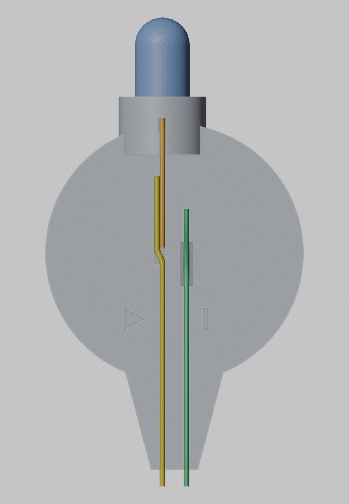
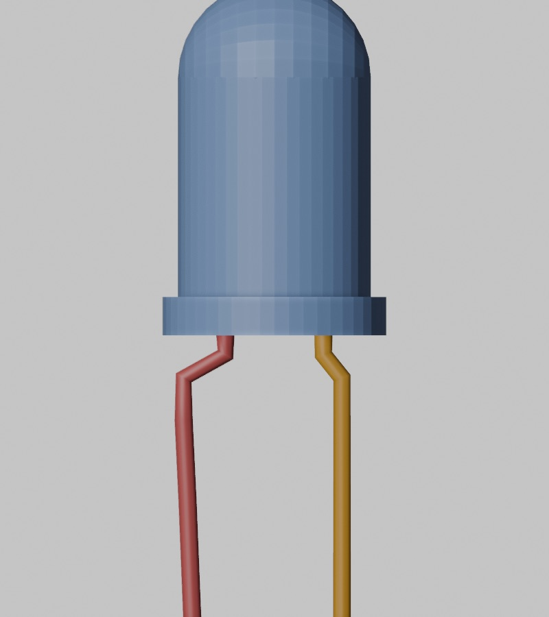
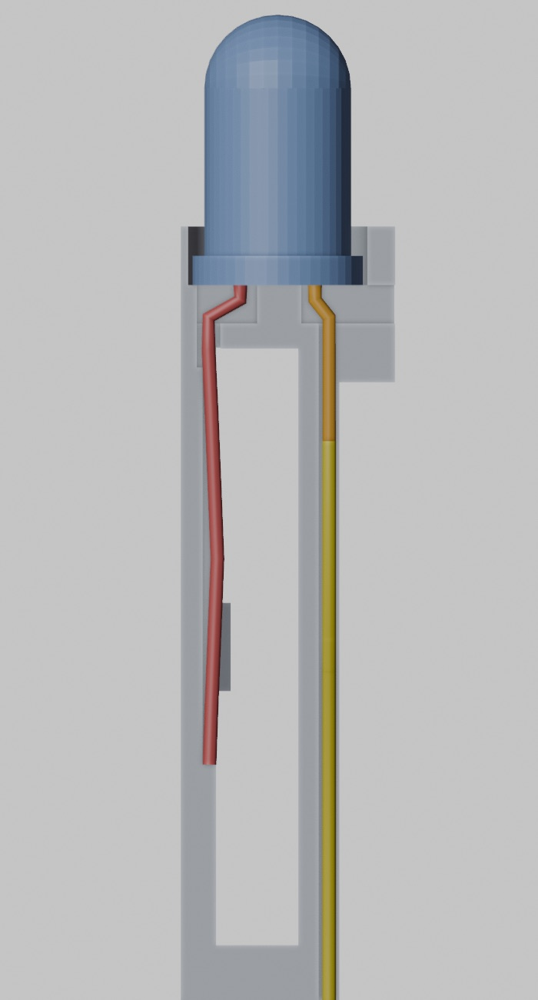
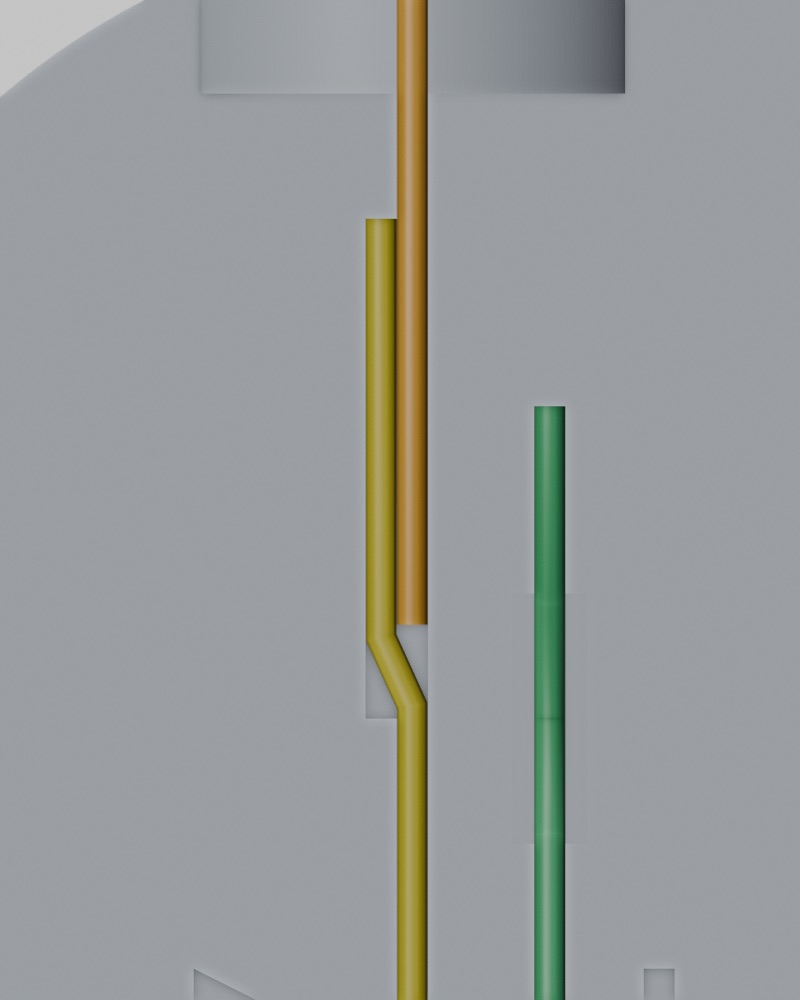
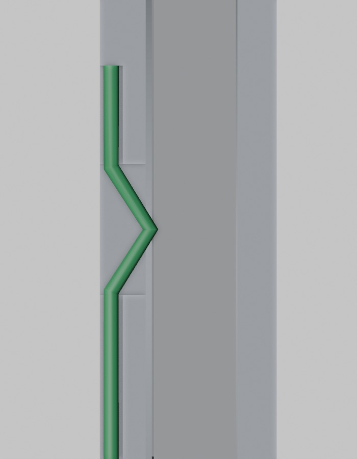
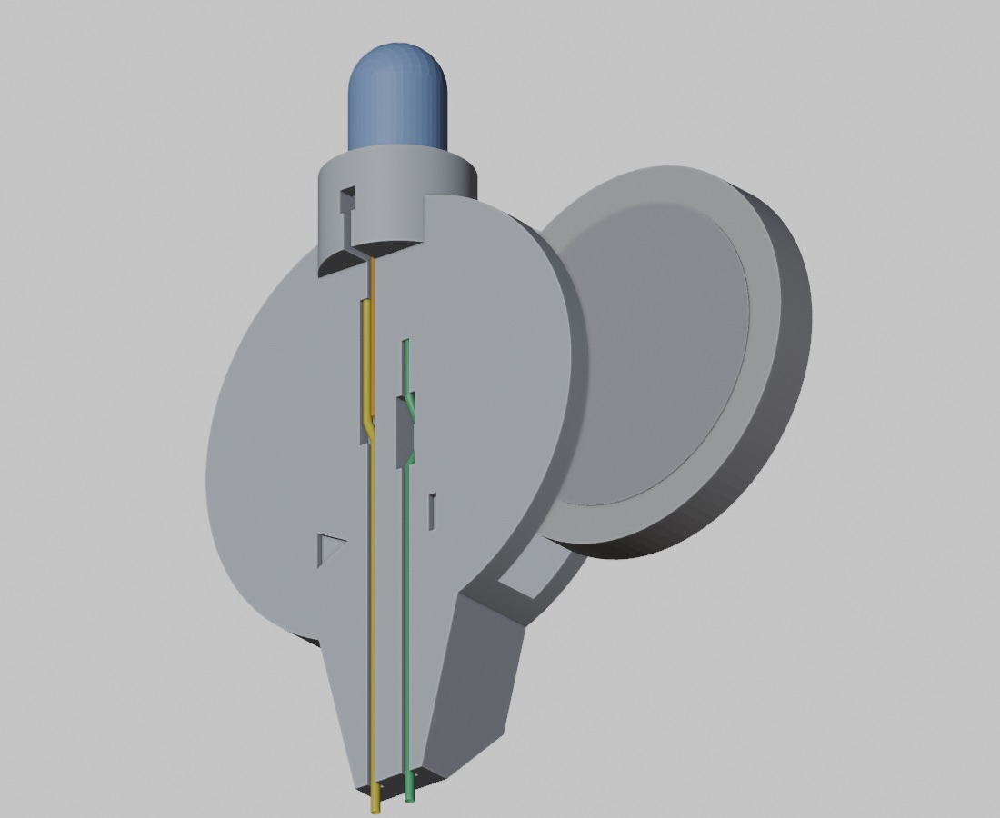
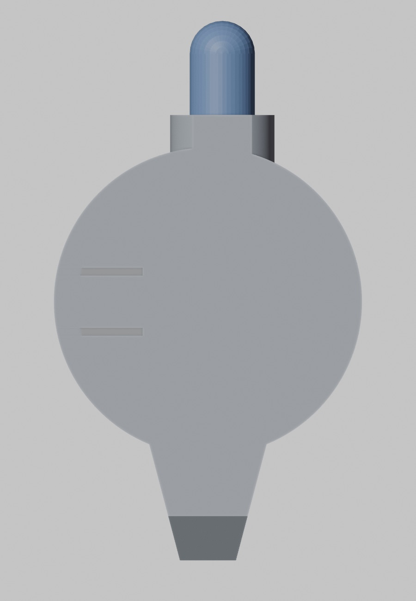

# cr2025-led-tester
CR2025 LED Tester - 3D Printer

- 조립·사용 안내: [docs/assembly.md](docs/assembly.md)
- 노즈 시험편(프로브 간격·홈 폭 맞추기): [docs/coupon.md](docs/coupon.md)
- 인쇄 파일: `stl/tester.stl`, `stl/nose-coupon.stl` · 모델 원본: `cad/` (FreeCAD `freecadcmd` 스크립트)

## 철사 연결 방법

철사 4가닥을 케이스 홈에 눌러 끼우고, **배터리는 맨 마지막에** 넣습니다. 납땜은 필요 없습니다. 아래 그림은 실제 모델(`stl/tester.stl`)에 철사를 색깔별로 그려 넣은 것입니다.

| 색 | 철사 | 가는 곳 |
|---|---|---|
| 🔴 빨강 | **② 애노드 다리**: LED 긴 다리 | 뒤쪽 터널 → 배터리 자리 안쪽 뒷벽 홈 → 배터리 **뒷면(+)** |
| 🟠 주황 | **캐소드 다리**: LED 짧은 다리 | 앞면 홈 A → ① 이음부 |
| 🟡 노랑 | **① 연장 다리 A**: 잘라낸 다리 1가닥 | 이음부에서 주황과 나란히 → 노즈 끝 **A** (▶ 쪽) |
| 🟢 초록 | **③ 철사 B**: 잘라낸 다리 1가닥 | 홈 B → 창에서 V자 → 배터리 **앞면(−)**, 노즈 끝 **B** (\| 쪽) |

### 완성된 모습 (정면, 홈이 있는 면)



- 맨 위가 **LED**입니다. 주황 캐소드 다리가 앞면 **홈 A**로 내려옵니다.
- 홈이 두 배로 넓은 구간이 **① 이음부**입니다. 여기서 노랑 연장 다리가 주황 옆에 나란히 눌려 이어지고, 노즈 끝 **A**까지 내려갑니다.
- 초록 철사 B는 오른쪽 홈 B에 들어갑니다. 가운데 회색 사각형이 **③ 창**이고, 여기서 V자로 꺾여 배터리를 누릅니다. 끝은 노즈 **B**입니다.
- 빨강 애노드 다리는 앞판에 가려 정면에서는 보이지 않습니다. 아래 2단계의 단면 그림을 보세요.

전류는 다음 순서로 흐릅니다.

```
배터리(+) → 빨강 → LED → 주황 → 노랑 → 끝 A → 측정 대상 다이오드 → 끝 B → 초록 → 배터리(−)
```

### 1. LED 다리 벌리기



옆에서 본 모습입니다(왼쪽 = 케이스 뒤, 오른쪽 = 앞). 플랜지 바로 아래에서 **긴 다리(애노드, 빨강)**를 **뒤로 약 1mm**, **짧은 다리(캐소드, 주황)**를 **앞으로 약 0.5mm** 꺾습니다. 캐소드는 LED 플랜지의 **평평한 쪽**에 있는 다리입니다.

### 2. LED 꽂기와 ② 애노드 다리 (단면)



케이스를 LED 줄에서 세로로 자른 단면입니다. 왼쪽이 뒤, 오른쪽이 앞이고, 가운데 빈 곳이 배터리 자리입니다.

- LED를 받침 위에서 내려 꽂습니다.
- **빨강**은 뒤쪽 터널을 지나 배터리 자리 안쪽 **뒷벽 홈**을 따라 내려갑니다. **주황**은 앞면 홈 A로 들어갑니다.
- 빨강은 홈 끝(배터리 중심에서 약 4mm 아래)에서 자르고, 가운데를 배터리 쪽으로 **약 0.5mm 활처럼** 휘게 합니다. 이 휨이 배터리 (+) 면을 누르는 스프링입니다.

### 3. ① 이음부: 주황 + 노랑



- **주황**은 넓은 구간의 아래쪽 끝보다 **약 1.5mm 위**에서 자릅니다.
- **노랑**(잘라낸 다리)은 넓은 구간 위쪽 끝부터 주황 **왼쪽 옆에 나란히** 눌러 넣습니다. 주황이 끝난 아래에서 홈 가운데로 살짝 옮긴 뒤 노즈 끝까지 눌러 넣습니다.
- 노랑의 끝은 노즈 밖으로 **1.5mm** 남기고 **사선으로** 자릅니다.

두 다리가 약 6mm 맞붙어 전기가 통합니다.

### 4. ③ 철사 B: 창에서 V자 (단면)



철사 B 줄에서 자른 단면입니다. 왼쪽이 앞, 오른쪽이 뒤이고, 가운데 진한 회색이 배터리입니다.

- **초록**을 홈 B 위쪽 끝(창 위 3mm)부터 눌러 넣습니다.
- **창 위치에서 V자로 꺾어** 창 안으로 약 1mm 들어가게 합니다. 배터리를 넣으면 V자 끝이 배터리 **앞면(−)**을 누릅니다.
- 나머지는 노즈 끝까지 넣고, 1.5mm 남겨 사선으로 자릅니다.

### 5. 배터리는 맨 마지막 → 오른쪽 슬롯



각인이 있는 **(+) 면을 뒤(바닥 쪽)**, 작은 **(−) 면을 앞(창 쪽)**으로 두고, 정면에서 볼 때 **오른쪽 옆 틈**으로 밀어 넣습니다. 배터리는 빨강 스프링과 초록 V자 사이로 들어가고, 뒷판의 턱을 넘으면서 **딸깍** 걸립니다. 배터리를 먼저 넣으면 빨강과 초록을 넣을 수 없습니다.

### 6. 뒷면: 배터리 빼기와 자가 진단



- 뒤에서 보면 좌우가 뒤집혀 슬롯이 왼쪽에 있습니다. **두 줄 틈 사이의 혀**를 손톱으로 누르면 턱이 내려가 배터리를 밀어낼 수 있습니다.
- 조립이 끝나면 **끝 A와 B를 맞대 보세요**. LED가 켜지면 정상입니다(자가 진단).
- 1분 뒤 배터리가 따뜻하면 초록이 배터리 테두리에 닿은 것입니다. 바로 배터리를 빼세요.

판정 규칙, 인쇄 설정, 문제 해결은 [docs/assembly.md](docs/assembly.md)에 있습니다.

```
LED 다리 벌리기 → LED 꽂기·빨강 → 주황 자르기·노랑 잇기 → 초록 V자 → 배터리 → 자가 진단
```
