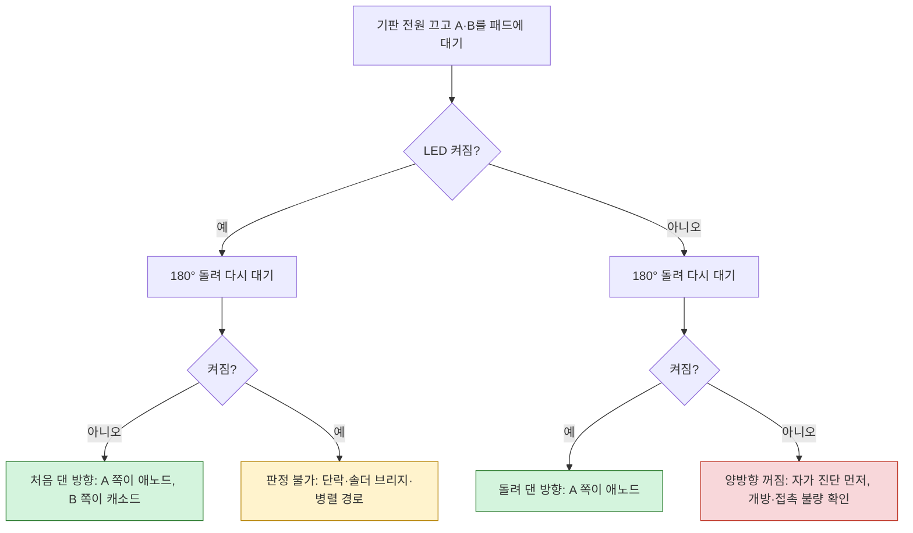

# CR2025 극성 테스터 조립·사용 안내

CR2025 하나와 파란 5mm LED로, 검사 기판에 납땜된 1N4148WS(SOD-323)의 방향을 확인하는 도구입니다. 노즈 끝의 두 철사를 다이오드 양쪽 패드에 대면, 방향이 맞을 때 위쪽 LED가 켜집니다. 납땜은 필요 없습니다. 모든 철사는 케이스 홈에 눌러 끼웁니다.

## 구조

정면(홈이 있는 면)에서 볼 때 기준입니다. LED는 위, 노즈는 아래, 배터리 슬롯은 오른쪽에 있습니다.

| 표시 | 부위 | 역할 |
|---|---|---|
| ① | 철사 A 홈의 이음부(홈이 두 배로 넓은 8mm 구간) | LED 캐소드 다리와 연장 다리를 나란히 눌러 잇습니다. |
| ② | 뒷벽 안쪽의 애노드 홈 | LED 애노드 다리가 배터리 **뒷면(+)**을 누릅니다. |
| ③ | 홈 B 끝의 통과 구멍(0.6 × 1.2mm)과 앞판 안쪽 천장의 접촉 홈 | 철사 B가 구멍을 비스듬히 지나 천장 홈에 눕고, 약 4.4mm 구간이 배터리 **앞면(−)**에 선으로 닿습니다. |
| 케이블 커버 | 노즈 앞면을 덮는 별도 부품(`stl/cover.stl`)과 노즈 윗부분의 고정 구멍 2개 | 철사를 홈에 올려놓은 뒤 커버 핀 2개를 구멍에 꽂아 덮습니다. 끝으로 패드를 눌러도 철사가 빠지지 않습니다. |
| A / B | 노즈 끝 왼쪽 / 오른쪽 철사 | 프로브 A, 프로브 B. 간격은 2.2mm입니다. |
| ▶ / \| | 앞면 각인. 삼각형은 A 왼쪽, 막대는 B 오른쪽 | LED가 켜졌을 때 다이오드 기호가 가리키는 방향입니다. |
| 혀와 턱 | 뒷판 오른쪽의 갈라진 혀와 그 위의 작은 턱 | 배터리가 빠지지 않게 붙잡는 걸림턱입니다. |

어떤 철사도 배터리의 옆 테두리나 (−) 면 가장자리에 닿지 않도록 홈이 플라스틱으로 절연되어 있습니다. 그 두께는 0.7mm로, `cad/check_tester.py`가 확인합니다. CR2025의 (+) 캔은 옆 테두리를 감싸고 (−) 면 가장자리까지 말려 올라와 있어서, 철사 B가 테두리에 닿으면 배터리가 단락됩니다.

전류는 다음 순서로 흐릅니다.

```
배터리 뒷면(+) → ② 애노드 다리 → 파란 LED → ① 철사 A → 끝 A → 측정 대상 다이오드 → 끝 B → 철사 B → ③ 통과 구멍 → 천장 접촉 홈 → 배터리 앞면(−)
```

## 부품

- 인쇄한 본체 `stl/tester.stl`, 케이블 커버 `stl/cover.stl`
- CR2025 1개
- 파란 5mm LED 1개. 시험편에서 밝기 충분을 확인했습니다.
- 잘라낸 다리 2가닥. 끝을 자를 여유를 두어 연장 다리 A는 **약 32mm**, 철사 B는 **약 30mm**로 준비합니다. 1/4W 저항 다리가 짧으면 같은 굵기(Ø0.5)의 구리 단선을 써도 됩니다. A와 B는 스프링 역할이 없어서 무른 철사도 괜찮습니다.
- 니퍼, 롱노즈 플라이어, 핀셋

## 인쇄

- 프린터: Bambu, PLA, 0.4mm 노즐
- 레이어: 0.12–0.16mm. 홈 깊이가 0.7mm, 각인 깊이가 0.4mm입니다.
- 방향: **평평한 뒷면을 바닥에** 둡니다. 서포트는 필요 없습니다.
  - 배터리 포켓 천장은 약 20mm를 가로지르는 브리지로 인쇄됩니다. 천장이 처지면 배터리가 빡빡해질 수 있습니다.
  - 노즈 끝 뒷면은 45°로 깎여 있어 서포트 없이 인쇄됩니다.
- 케이블 커버는 파일 그대로(판이 바닥, 핀 2개가 위) 인쇄합니다. 서포트는 필요 없습니다.
  - 핀(Ø1.4)과 본체 고정 구멍(Ø1.5)은 세로 구멍이 인쇄 중 약간 좁아지는 것을 감안해 꽉 끼도록 잡았습니다 [중간].
  - 너무 빡빡하면 Ø1.5 드릴로 구멍을 한 번 돌려 주고, 헐거우면 핀에 테이프를 한 겹 감거나 순간접착제를 조금 바릅니다.
- 크기는 약 23.6 × 34.1 × 7.3mm입니다.

코드로 다시 만들려면 다음 명령을 실행합니다. 두 명령 모두 결과는 출력 줄(`BUILD OK`, `CHECK OK`)로 판단합니다. `freecadcmd`는 실패해도 종료 코드 0을 돌려주기 때문입니다.

```sh
FC=/Applications/FreeCAD.app/Contents/Resources/bin/freecadcmd
$FC cad/tester.py         # → BUILD OK stl/tester.stl + cad/tester.FCStd
$FC cad/check_tester.py   # → CHECK OK (포켓·간격·절연층·통과 구멍 크기·(−) 접촉 길이와 위치·LED 자리를 STL에서 직접 잰 값)
```

치수를 바꾸려면 `cad/params.py`를 고친 뒤 위 두 명령을 다시 실행합니다. 프로브 간격(`PROBE_SPACING`)과 홈 폭(`GROOVE_W`)은 노즈 시험편 결과(`docs/coupon.md`)로 정한 값입니다.

## 조립

순서가 중요합니다. **배터리는 맨 마지막에 넣습니다.** 먼저 넣으면 ②와 ③ 다리를 넣을 수 없습니다.

1. **LED 다리 벌리기.** LED 플랜지의 평평한 쪽이 캐소드(짧은 다리)입니다. 캐소드를 **앞(홈 쪽)**, 애노드(긴 다리)를 **뒤**로 둡니다. 플랜지 바로 아래에서 애노드는 뒤로 약 1mm, 캐소드는 앞으로 약 0.5mm 벌립니다.
2. **LED 꽂기.** 받침 위에서 LED를 내려 꽂습니다. 애노드는 뒤쪽 깔때기와 터널로, 캐소드는 앞쪽 슬롯(홈 A)으로 들어갑니다. 플랜지가 자리 바닥에 닿을 때까지 누릅니다.
3. **② 애노드 다리.** 터널을 지난 다리는 배터리 슬롯 안쪽 뒷벽의 홈을 따라 내려갑니다.
   - 홈 끝(배터리 중심에서 약 4mm 아래)에 맞춰 자릅니다.
   - 슬롯 쪽에서 보면서 다리 가운데를 배터리 쪽으로 약 0.5mm 활처럼 휘게 합니다. 이 휨이 배터리를 누르는 스프링이 됩니다.
4. **캐소드 다리.** 홈 A에 핀셋 뒷면으로 눌러 넣고, ① 이음부의 아래쪽 끝보다 **약 1.5mm 위**에서 자릅니다. 연장 다리가 그 아래 공간에서 홈 가운데로 옮겨 가야 하기 때문입니다.
5. **① 연장 다리 A.**
   - 잘라낸 다리 한 가닥을 이음부 위쪽 끝부터 캐소드 다리 **옆에 나란히** 눌러 넣습니다.
   - 캐소드 다리가 끝난 곳 아래에서 홈 가운데로 살짝 옮긴 뒤, 홈 A를 따라 노즈 끝까지 **위에서 눌러** 넣습니다.
   - 노즈 끝으로 나온 부분은 **1.5mm** 남기고 **사선으로** 자릅니다. 사선 끝이 플럭스 잔여물을 뚫습니다.
6. **③ 철사 B.** 잘라낸 다리 한 가닥의 한쪽 끝에서 **약 5mm**, **약 6mm** 되는 두 곳을 서로 반대 방향으로 조금씩 꺾습니다. 끝 5mm가 나머지보다 약 0.9mm 낮은 **계단(크랭크) 모양**이 됩니다(README 그림 4).
   - 끝 5mm를 ③ 통과 구멍(홈 B 위쪽 끝의 0.6 × 1.2mm 구멍)으로 **위쪽을 향해 비스듬히** 밀어 넣습니다.
   - 슬롯 쪽에서 핀셋으로 끝 5mm를 배터리 자리 천장 안쪽의 **접촉 홈**(구멍에서 위로 약 4.4mm)에 눌러 눕힙니다.
   - 나머지는 구멍에서 노즈 끝까지 홈 B에 **위에서 눌러** 넣고, 노즈 끝으로 나온 부분은 1.5mm 남겨 사선으로 자릅니다.
   - 배터리를 넣으면 뒤쪽 ② 애노드 휨이 배터리를 앞으로 밀어, 천장 홈에 누운 약 4.4mm 구간 전체가 배터리 (−) 면에 **선으로** 닿습니다.
7. **케이블 커버 덮기.** 커버의 판이 노즈 앞면을 향하게 하고, 핀 2개를 노즈 윗부분의 고정 구멍에 맞춰 끝까지 눌러 꽂습니다. 판이 노즈 구간의 철사 A·B를 홈 속으로 눌러 잡습니다. 철사를 고칠 때는 커버 가장자리를 손톱으로 들어 빼면 됩니다.
8. **배터리 넣기.** 각인이 있는 **(+) 면을 뒤(바닥면)**, **(−) 면을 앞(홈 쪽)**으로 두고, 정면에서 볼 때 **오른쪽 슬롯**으로 밀어 넣습니다. 뒷판 혀의 턱을 넘으면서 딸깍 걸립니다. 꺼낼 때는 뒷면의 혀를 손톱으로 눌러 턱을 내리고 밀어냅니다.
9. **자가 진단.** 끝 A와 B를 맞대면 LED가 켜져야 합니다. 켜지지 않으면 다음을 차례로 확인합니다.
   - 배터리 방향 ((+) 면이 뒤)
   - LED 방향 (캐소드가 앞)
   - ②가 배터리를 누르는 휨
   - ③ 끝 5mm가 천장 접촉 홈에 제대로 누워 있는지
   - ① 이음부의 두 다리가 붙어 있는지
10. **단락 확인.** 조립 후 1분쯤 지나 배터리가 따뜻해지지 않았는지 만져 봅니다. 따뜻하면 철사 B가 배터리 테두리에 닿은 것이니 바로 배터리를 빼세요.

```
LED 다리 벌리기 → LED 꽂기 → ② 애노드 휨·자르기 → 캐소드 자르기 → ① 연장 다리 A → ③ 철사 B → 케이블 커버 → 배터리 → 자가 진단 → 단락 확인
```

## 사용과 판정

1. **기판 전원을 끕니다.** 전원이 켜진 기판에서는 판정이 틀리고 부품이 상할 수 있습니다.
2. 확대경으로 보면서 노즈 끝 두 철사를 1N4148WS 양쪽 패드(몸체 밖으로 드러난 납땜부)에 동시에 댑니다.
3. 결과를 다음 규칙으로 읽습니다.
   - **켜짐**: A(▶ 쪽)에 닿은 패드가 애노드, B(| 쪽)가 캐소드입니다. 각인 ▶|가 그대로 다이오드 기호 방향이고, 다이오드의 띠는 B 쪽에 있어야 합니다.
   - **꺼짐**: 테스터를 180° 돌려 다시 댑니다. 이번에 켜지면 **돌려 댄 방향**에서 A 쪽 패드가 애노드입니다. 처음 예상과 반대로 실장된 것입니다.
   - **양방향 모두 켜짐**: **판정 불가**입니다. 단락, 솔더 브리지, 또는 병렬로 연결된 부품 경로 때문입니다. 병렬 경로가 대략 10kΩ 이하이면 이렇게 될 수 있습니다 [중간]. 부품을 떼어 확인합니다.
   - **양방향 모두 꺼짐**: 개방(다이오드 불량), 접촉 불량, 또는 테스터 문제입니다. 먼저 **자가 진단**으로 테스터가 정상인지 확인하세요.



## 파란 LED와 배터리

파란 LED(Vf 약 2.8–3.3V)와 다이오드(약 0.6–0.7V)를 직렬로 연결하면 합계가 CR2025 전압(새 배터리 약 3.2V)과 비슷합니다. 시험편에서는 밝기가 충분했지만, **배터리가 닳으면 먼저 희미해집니다.** 새 배터리로 바꿔도 희미하면 빨간 5mm LED로 바꾸세요. 규격이 같은 5mm라 본체를 다시 인쇄할 필요가 없습니다.

## 확인이 더 필요한 가정

- **(−) 면 안전 반경 6mm**: ③ 철사 B가 (−) 면에 닿는 구간은 배터리 중심에서 약 5mm 안쪽입니다. 쓰는 CR2025의 (−) 면 평평한 부분이 이보다 넓은지 한 번 확인하세요.
- **프로브 간격 2.2mm**: 시험한 범위(2.2–2.6)의 가장 작은 값입니다. 끝이 SOD-323 몸체 가장자리를 누르는 것 같으면 `PROBE_SPACING`을 조금 넓혀 다시 인쇄합니다.
